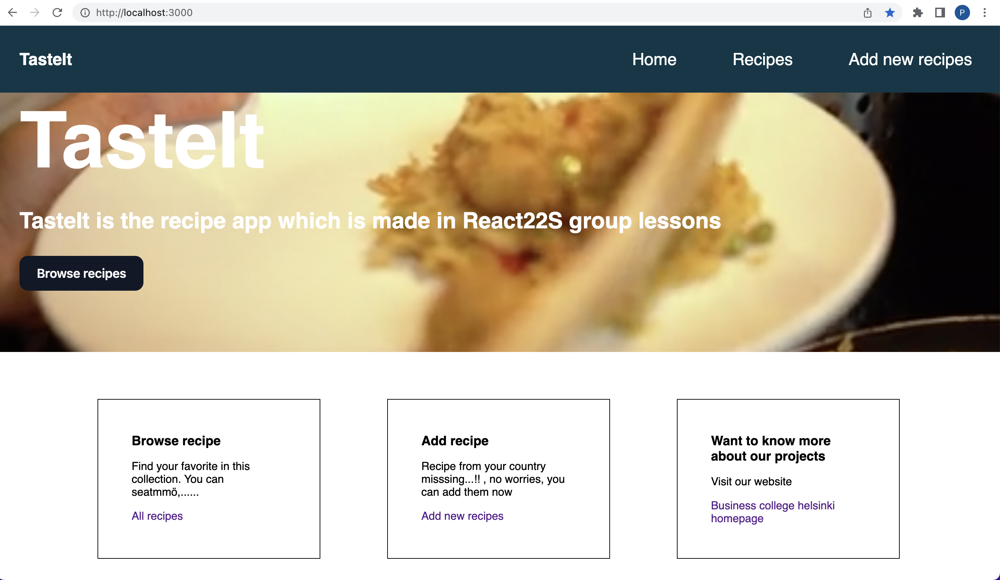

# TasteIt

This application is about recipes where user can see all recipes and add their own recipes.



## Technologies used

- React
- Json server
- React Hook Form
- Axios

## Technical details

This application has two folder, client and server.

### Client

- This comprises the code for the client facing application.
- This is built in react.
- [React-hook-form](https://react-hook-form.com/) is used for creating forms in the application

#### Run test

To check the tests of client application, run below command

```bash
cd client
npm install
npm run test
```

### Server

- This is a node server, which is serving the data for the front-end application.
- [Json-server](https://github.com/typicode/json-server) is used to quickly build the rest api's out of db.
- Recipe data is saved in [db.json](./server/db.json)

## How to run

Clone the repo and set up the project:

In order to run server, run below command

```bash
cd server
npm install
npm run server
```

server will start running on port 3001 http://localhost:3001

In order to run client, run below command

```bash
cd client
npm install
npm start
```

Open http://localhost:3000 in a browser
